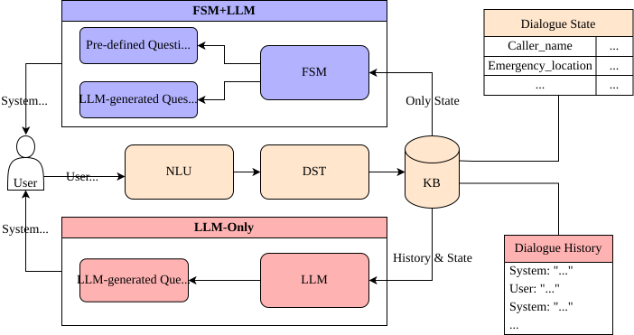

# ems-prepared

Code for *Preparing Citizens for Emergency Calls with a Hybrid FSM-LLM Dialogue Agent*.

This repository contains the emergency-call simulator, the graph-based hybrid policy, the LLM-only baseline, and the scenario description and ground truths used in the study.



## Installation

- Python `>=3.13` and `uv`

```bash
uv sync
```

Set `GOOGLE_API_KEY` before running the app.

## Run

Use the Gradio app unless you specifically want to work on one of the lower-level entrypoints.

| Purpose | Command | Notes |
| --- | --- | --- |
| Main web UI | `uv run python -m ems_prepared.adapters.gradio.app --scenario-dir ./assets/scenarios` | Recommended entrypoint. The scenario directory must be passed explicitly in this checkout. |
| Graph policy in the terminal | `uv run python -m ems_prepared.policies.pydantic_graph.emergency_main_graph` | Runs the hybrid FSM/graph-based policy directly. |
| LLM-only baseline in the terminal | `uv run python -m ems_prepared.policies.llm_only.agent` | Runs the baseline agent directly. |

## Repository Structure

```text
ems-prepared/
├── src/ems_prepared/
│   ├── adapters/                 # User-facing application entrypoints
│   ├── agents/                   # LLM prompting and task-specific agent logic
│   ├── dialogue_state/           # Structured emergency-call state definitions
│   ├── locale/                   # Static questions and instructions used by the agent
│   ├── policies/
│   │   ├── llm_only/             # LLM-only baseline
│   │   ├── pydantic_graph/       # Hybrid FSM/graph-based policy
│   │   └── shared.py             # Shared save/merge helpers
│   └── util/                     # Logging, settings, model helpers
├── assets/
│   ├── scenarios/                # Scenario description and ground truths
│   └── slack_webhook/            # Optional deployment/support 
├── notebooks/                    # Evaluation and exploratory analysis
├── logs/                         # Per-session outputs written at runtime
├── pyproject.toml
└── mise.toml
```

## Scenarios and Evaluation Assets

Scenario assets are in [assets/scenarios](/home/seapat/Desktop/ems-prepared-main/assets/scenarios).

- [_Instructions.md](/home/seapat/Desktop/ems-prepared-main/assets/scenarios/_Instructions.md): shared caller instructions
- [_Scenario_Template.md](/home/seapat/Desktop/ems-prepared-main/assets/scenarios/_Scenario_Template.md): template for new scenarios
- [ScenarioGroundTruth](/home/seapat/Desktop/ems-prepared-main/assets/scenarios/ScenarioGroundTruth): reference outcome/state annotations

The evaluation of the user experiments is done in [notebooks/experiment_evaluation.py](/home/seapat/Desktop/ems-prepared-main/notebooks/experiment_evaluation.py).

## Session Outputs

Each run writes session artifacts under:

```text
logs/<experiment>/<user>/<session>/
```

Typical outputs include:

- `stdout.log`
- `messages.tsv`
- `state_changes.jsonl`
- `final_state.json`
- `message_history.json`
- `deps.json`
- graph persistence files and Mermaid exports for graph-based runs

## Citation

```bibtex
@inproceedings{,
  author = {},
  title = {},
  booktitle = {},
  year = {},
}
```
