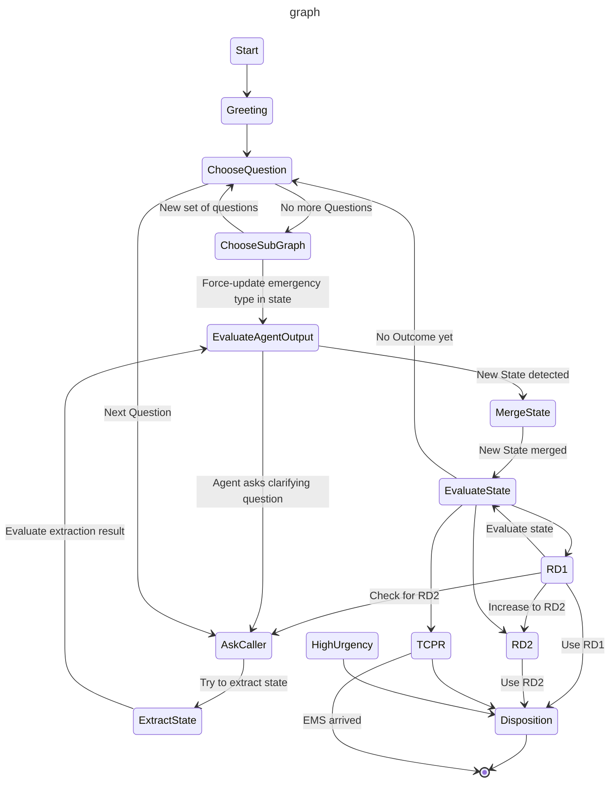

```mermaid
---
title: graph
---
stateDiagram-v2
  Start --> Greeting
  Greeting --> ChooseQuestion
  AskCaller --> ExtractState: Try to extract state
  RD1 --> RD2: Increase to RD2
  RD1 --> Disposition: Use RD1
  RD1 --> AskCaller: Check for RD2
  RD1 --> EvaluateState: Evaluate state
  RD2 --> Disposition: Use RD2
  Disposition --> [*]
  ChooseSubGraph --> ChooseQuestion: New set of questions
  ChooseSubGraph --> EvaluateAgentOutput: Force-update emergency type in state
  EvaluateState --> ChooseQuestion: No Outcome yet
  EvaluateState --> RD2
  EvaluateState --> RD1
  EvaluateState --> TCPR
  EvaluateAgentOutput --> AskCaller: Agent asks clarifying question
  EvaluateAgentOutput --> MergeState: New State detected
  TCPR --> Disposition
  TCPR --> [*]: EMS arrived
  HighUrgency --> Disposition
  ChooseQuestion --> ChooseSubGraph: No more Questions
  ChooseQuestion --> AskCaller: Next Question
  ExtractState --> EvaluateAgentOutput: Evaluate extraction result
  MergeState --> EvaluateState: New State merged
```